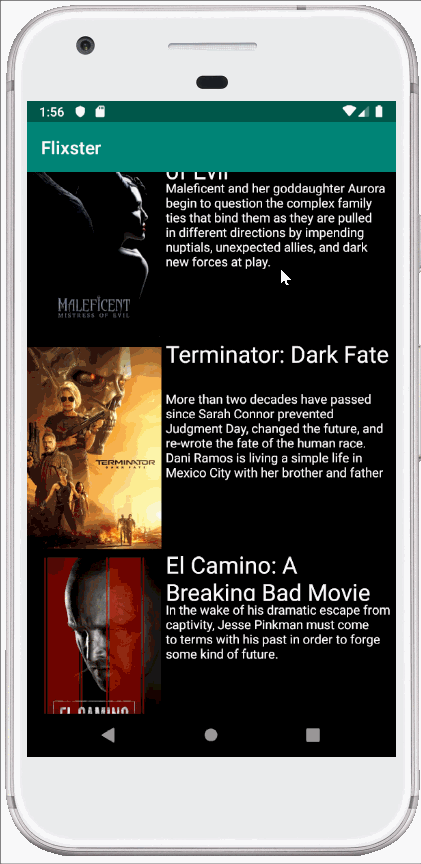

# Flix
Flix is an app that allows users to browse movies from the [The Movie Database API](http://docs.themoviedb.apiary.io/#).

### User Stories
- [X] (10pts) User can view a list of movies (title, poster image, and overview) currently playing in theaters from the Movie Database API.
- [X] (8pts) Expose details of movie (ratings using RatingBar, popularity, and synopsis) in a separate activity.
- [X] (2pts) Allow video posts to be played in full-screen using the YouTubePlayerView.
- [X] (2pts) Improved the user interface by experimenting with styling and coloring.

### App Walkthough GIF
 

## Open-source libraries used
- [Android Async HTTP](https://github.com/codepath/CPAsyncHttpClient) - Simple asynchronous HTTP requests with JSON parsing
- [Glide](https://github.com/bumptech/glide) - Image loading and caching library for Android
