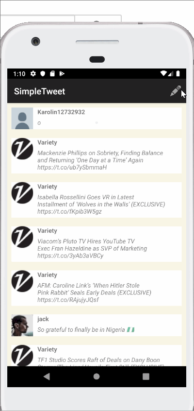

# Project 2 - SimpleTweet

SimpleTweet is an android app that allows a user to view his Twitter timeline and post a new tweet. The app utilizes [Twitter REST API](https://dev.twitter.com/rest/public).

## User Stories

The following **required** functionality is completed:

- [X] User can **compose and post a new tweet**
- [X] User can click a “Compose” icon in the Action Bar on the top right
- [X] User can then enter a new tweet and post this to twitter
- [X] User is taken back to home timeline with **new tweet visible** in timeline
- [X] Newly created tweet should be manually inserted into the timeline and not rely on a full refresh
- [X] User can **pull down to refresh tweets timeline**
- [X] Use Parcelable instead of Serializable using the popular [Parceler library](http://guides.codepath.org/android/Using-Parceler).

## Video Walkthrough

Here's a walkthrough of implemented user stories:

GIF created with [LiceCap](http://www.cockos.com/licecap/).

## Open-source libraries used

- [Android Async HTTP](https://github.com/codepath/CPAsyncHttpClient) - Simple asynchronous HTTP requests with JSON parsing
- [Glide](https://github.com/bumptech/glide) - Image loading and caching library for Android
